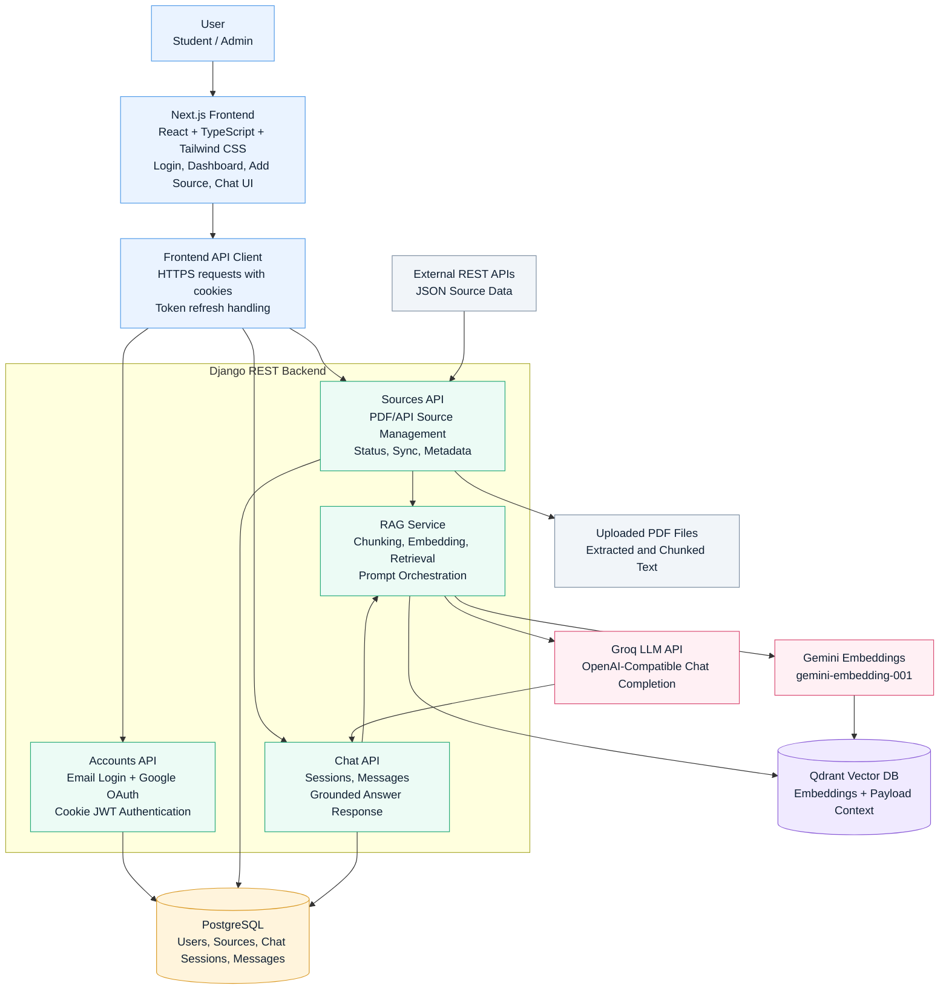

# System Architecture Diagram

## RAG Query Flow

1. User asks a question from a selected source.
2. Backend creates a Gemini query embedding.
3. Qdrant returns the most relevant source chunks.
4. Retrieved context is sent to the Groq LLM with grounding instructions.
5. The generated answer is saved in chat history and returned to the frontend.
